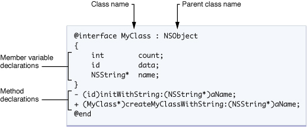

# C vs OC

> 学习OC过程中总结的区别
>
> 帮助自己更好的理解OC的设计和底层机制

OC是C的**超集**，也就是OC可以兼容C的所有代码，并且在C的基础上做了**扩展**（下面会讲到：主要是面向对象）。

具体体现在：

- 类
- 字符串
- 消息传递机制
- Foundation框架


## 类



类的定义主要分两部分：**Interface**, **Implementation**

### Interface

```objective-c
@interface MyObject : NSObject {
    int memberVar1; // 实体变量
    id  memberVar2;
}

+(return_type) class_method; // 类方法

-(return_type) instance_method1; // 实例方法
-(return_type) instance_method2: (int) p1;
-(return_type) instance_method3: (int) p1 andPar: (int) p2;
@end
```

定义类方法的时候前面带 +

定义实例方法的时候前面带 -

-----------------------

特点：方法头用 “ : ” 传递参数，方法名可以夹杂在参数中间，可读性更高。

```objective-c
- (void) setColorToRed: (float)red Green: (float)green Blue:(float)blue; /* 宣告方法*/

[myColor setColorToRed: 1.0 Green: 0.8 Blue: 0.2]; /* 呼叫方法*/
```

### 继承

#### 根类

NSObject是所有类的父类。

init和alloc这两个创建对象常用的方法都是来自NSObject类。

#### self关键字

```objective-c
self.var; //获取self对象的var变量
//上面的表达式等价于
[self var]; //向当前对象发送var消息 返回var的值

//同理
self.var1.var2;
//等价于
[[self var1] var2];
```

#### 对象的初始化

我们可以通过重载**init**方法来实现自定义的初始化。

自定义初始化init的模板：

```objective-c
-(instancetype)init{
  self = [super init];
  if(self){ //若父类的初始化方法执行成功 self此时为非空的
    //code
  }
  return self;
}
```

此方法先调用父类的初始化方法

```objective-c
-(instancetype) init{ //自定义的init方法覆盖父类方法
    return [self initWith:0 and:0];
}

//Complex initWith:and: 方法实现
-(Complex *)initWith:(double)r and:(double)i{ //注意返回类型要和本类一致
    self = [super init]; //调用父类init方法
    if(self){ //初始化参数
        self.real = r;
        self.imaginary = i;
    }
    return self;
}

//自定义的init方法
Complex *p = [Complex new];//new方法实际上就是 alloc -> init
[p print];

//运行结果
//2020-05-31 20:16:52.177344+0800 first_programe[39806:2119481]  1 + 3i
//Program ended with exit code: 0
```

初始化的过程中还需要**alloc**方法，但是重载alloc方法并不是一个合适的做法，因为alloc方法涉及到内存的分配，所以一般来说不需要进行重载。

-----

### 多态、动态类型和动态绑定

#### 多态

相同名称、不同的类

```objective-c
#import <Foundation/Foundation.h>

@interface Complex : NSObject
	
```

#### 编译时和运行时检查❗️

存储在id数据类型中的对象类型无法在编译阶段确定，所以在运行时才能发现错误。

```objective-c
Fraction *f1 = [Fraction new];		//分数类
[f setReal:1.0 andImaginary:3.0]; //传送复数类方法
//该程序在编译阶段报错 因为在 @interface Fraction 接口并没有声明 setReal:andImaginary: 方法

//--------------demo---------------
//ClassA接口
@interface ClassA : NSObject
{
    int var;
}
-(void)initVar: (int) v;
-(void)print;

@end
//id类型 编译阶段无法确定数据类型

id test = [ClassA new];
[test setReal:1 andImaginary:2]; // Complex类方法
[test print];// Complex类方法

//报错：
//2020-05-31 08:47:08.096952+0800 first_programe[36995:1771383] -[ClassA setReal:andImaginary:]: unrecognized //selector sent to instance 0x100607c20
```


> 实际上 NSObject 支持处理动态类型的一些基本方法。这些方法可以用来在运行时判断某个对象是否是我们所希望的类类型或某个类的子类，该类型是否实现了某些我们所期望的方法。

```objective-c
Boolean b = [d isMemberOfClass: [ClassA class]]; //检查id变量 d是否是ClassA的一个实例
if(b == true){
  NSLog(@"object d is member of Class:ClassA.");
}else{
  NSLog(@"object is No member of Class:ClassA");
}

//运行结果：
//2020-05-31 16:54:06.859495+0800 first_programe[39030:2028322] object is No member of Class:ClassA
//Program ended with exit code: 0
```


### 异常处理

OC使用try-catch来处理异常。

```objective-c
//ptr 初始化为ClassA类型
id ptr = [ClassA new];
@try{
  [ptr setReal:1 andImaginary:1]; //传入Complex方法的message 此处会发生异常
}
@catch(NSException *exp){ // 异常处理语句块
  NSLog(@"caught %@%@",[exp name],[exp reason]); //打印异常信息：name + reason “NSInvalidArgumentException”
}
NSLog(@"Excution continues!");//处理完异常之后会继续运行后面的代码

//运行结果：
//2020-05-31 17:09:05.485259+0800 first_programe[39297:2041307] -[ClassA setReal:andImaginary:]: unrecognized //selector sent to instance 0x10063e1f0
//2020-05-31 17:09:05.485399+0800 first_programe[39297:2041307] caught NSInvalidArgumentException-[ClassA //setReal:andImaginary:]: unrecognized selector sent to instance 0x10063e1f0
//2020-05-31 17:09:05.485429+0800 first_programe[39297:2041307] Excution continues!
//Program ended with exit code: 0
```

## 作用域

```objective-c
// Foo代码
@implementation Foo

-(void)setGlobalVar:(int)val {
    extern int gGlobalVar; //extern声明外部变量 此语句不会改变存储空间
    gGlobalVar = val;
}

@end

//file main.m
int gGlobalVar = 5;//全局变量
//func main()
NSLog(@"gVar = %i",gGlobalVar);//打印全局变量值
Foo *mFoo = [Foo new];
[mFoo setGlobalVar:10];				 //在另一个class里改变全局变量
NSLog(@"gVar = %i",gGlobalVar);

//运行结果
//2020-06-01 09:51:24.585698+0800 first_programe[41376:2298936] gVar = 5
//2020-06-01 09:51:24.586617+0800 first_programe[41376:2298936] gVar = 10
//Program ended with exit code: 0
```


## 字符串

OC完全支持C风格的字符串，但是自己提供了更好的NSString封装。

NSString提供的功能包括对保存任意长度字符串的内建内存管理机制，支持Unicode，printf风格的格式化工具等。


## 消息传递机制

从语言发展史来看OC是融合了C和Smalltalk的一门语言。其中，除了面向对象以外的部分几乎都承自C语言，面向对象部分的消息传递语法源于Smalltalk的message passing风格，从外在表现来看就是面向对象语法的区别。

C++中传递消息给对象（或称为调用一个对象方法）：

```c++
obj.method(argument);
```

OC中传递消息给对象：

```objective-c
[obj method: argument];
```

这两者的区别是：在C++中，语句的含义是，**调用obj对象的method方法**，如果obj对象不存在该方法，那么在编译阶段就会发生错误。而在OC中，含义是**将method消息传递给obj对象**，obj对象是消息的接收者，在obj接收到这个消息后决定如何去回复它，如果obj对象所属的类没有定义此方法，则**在运行时抛出异常**。