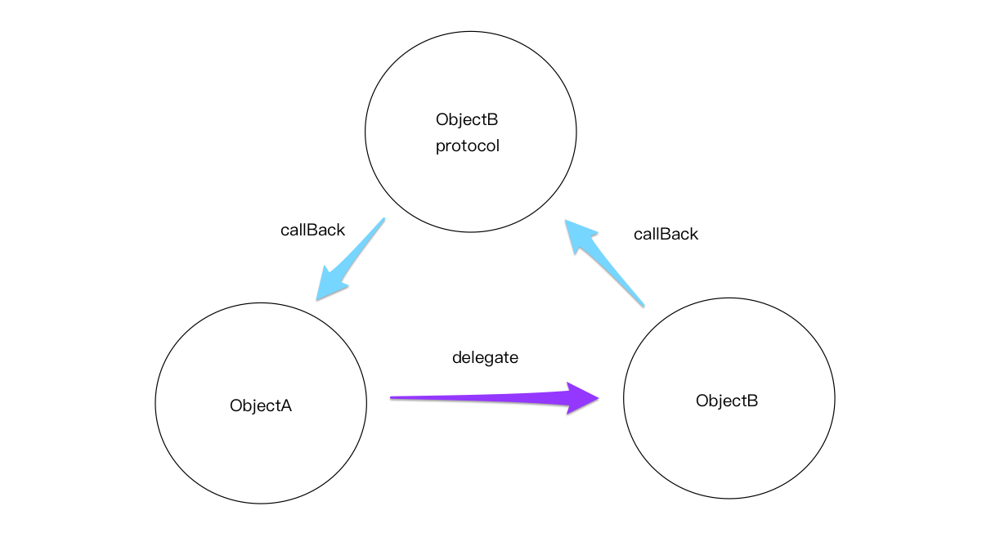

# Delegate & Protocol 代理和协议


示例：



上图表示A向B发起**委托**，需要B帮助处理事物，B就会向A提出**协议**供A实现，这样便于回调（callBack）来通知A对象委托的完成情况。

实际应用：


---

**Code** :

```objective-c
// 协议定义
@protocol SampleProtocolDelegate <NSObject>
@required
- (void) processCompleted; //协议要求实现的函数
@end
// 协议定义结束

@interface SampleProtocol : NSObject
{
   // Delegate to respond back
   id <SampleProtocolDelegate> _delegate;
}
@property (nonatomic,strong) id delegate;

-(void)startSampleProcess; // Instance method

@end
```

